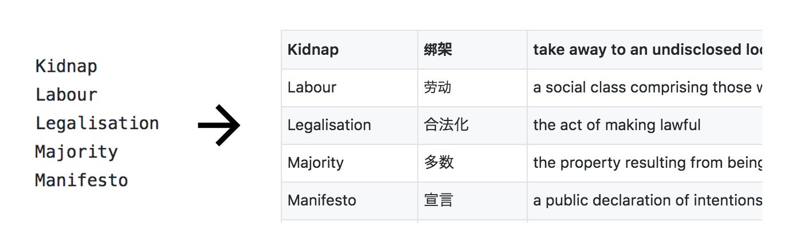

# SocialW
> For the weekly vocab homework of Social Studies 11

Converts a csv of words into a csv of words, Chinese translations and English definitions



## Installation

> Make sure you have [`python3`](https://www.python.org/downloads/) installed.

1. Clone the project.
2. Download the [stardict.7z](https://github.com/skywind3000/ECDICT/blob/master/stardict.7z).
3. Unzip it, put it in your project folder.
4. Convert it into `sd.sqlite` through the following command:

```sh
$ python3 -c 'import stardict; stardict.convert_dict("sd.sqlite", "stardict.csv")'
```

You can then delete the `stardict.csv` as it's now useless.

## Usage

1. Put your words in a `.csv` file seperated by lines or commas. Refer to the sample [here](https://github.com/HITGIF/socialw/blob/master/in.csv).
2. Put the input csv file in the project folder.
3. Run the following command:

```sh
$ python3 socialw.py <IMPUT_CSV> <OUTPUT_CSV>
```

A sample output will look like [this](https://github.com/HITGIF/socialw/blob/master/out.csv).

## Acknowledgement

The project won't be possible without the help of the following great projects:

- [ECDICT](https://github.com/skywind3000/ECDICT). A free English to Chinese Dictionary Database. By Linwei.

## License

    Copyright 2017 Carbonylgroup Studio

    Licensed under the Apache License, Version 2.0 (the "License");
    you may not use this file except in compliance with the License.
    You may obtain a copy of the License at

        http://www.apache.org/licenses/LICENSE-2.0

    Unless required by applicable law or agreed to in writing, software
    distributed under the License is distributed on an "AS IS" BASIS,
    WITHOUT WARRANTIES OR CONDITIONS OF ANY KIND, either express or implied.
    See the License for the specific language governing permissions and
    limitations under the License.
